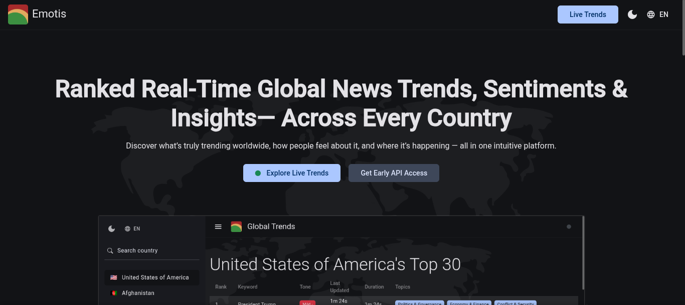
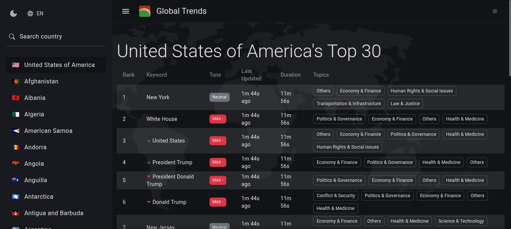

# Global Trends (GloTrends)

GloTrends is a fully automated public dashboard that tracks and ranks live global trending keywords/entities, with their sentiments and topics in real-time, by country.

Access it at [glotrends.online](https://glotrends.online).

---

## How it Works

1. Using GDELT 2.1, it obtains every new GKG and Events table files when updated, parses them, extracts all mentioned names (keywords, entites), processing them by their sentiments (tone), countries, topics (Labeled GKG themes), and counts.

2. It maintains a `trend` data object where it groups extracted keywords by their countries, ranks them by their counts, keeps note of their durations on the `trend` object, their topics, sentiments, and deltas (the directions and magnitude of their movements on their countries' `trend` table).

3. Every new data is smartly aggregated to the `trend` object and maintained.

4. Due to GDELT not specifically mentioning countries directly related to the events we extract keywords from, GloTrends finds these countries from the following sources, respectively:

   - The source domain of the event's article (e.g. `something.com.countryCode`).

   - Countries related to `Actor1` or `Actor2` extracted from the sources, on the Events table.

   - The most mentioned country in the event's article.

   - The first mentioned country in the event's article.

5. GloTrends uses Angular SSR with Socket.IO to maintain a real-time country-wise dashboard, and other related web pages, with support for localization (8 languges at the time of writing), theming (light/dark), S.E.O, and schema.

---

## Screenshots

<p align="center">
  
  
</p>

---

## Technical Overview

This project was generated using [Angular CLI](https://github.com/angular/angular-cli) version 20.1.5.

### Prerequisites

- Node.js (v16 or later)

- Angular CLI (v20 or later)

- A modern web browser

### Development server

To start a local development server, run:

```bash
ng serve
```

Once the server is running, open your browser and navigate to `http://localhost:4200/`. The application will automatically reload whenever you modify any of the source files.

### Building

To build the project run:

```bash
ng build
```

This will compile your project and store the build artifacts in the `dist/` directory. By default, the production build optimizes your application for performance and speed.

### Frameworks & Libraries

- **Backend**: `Express JS via Angular SSR`

  - RESTful APIs for accessing `trend` object.

  - Socket.IO integration for real-time updates.

  - `unzipper`, `split2`, `axios` for data sourcing and processing.

- **Frontend**: `Angular v20`

  - Responsive design and theming with `Angular Material` and `Bootstrap 5`.

  - Localization support using `@ngx-translate/core`.

---

## Roadmap

Future enhancements to GloTrends include:

1. An LLM layer for deduplicating keywords referring to sngle entities, and automatically translating them to all added languages, with support for caching since this would be resource-intensive.

2. Persistence, and a public API layer (Websocket and REST) granting access to live and historic trends data, charts, for deeper analysis and integration.