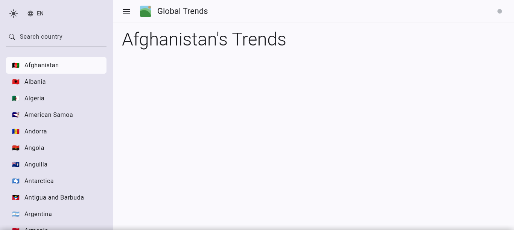
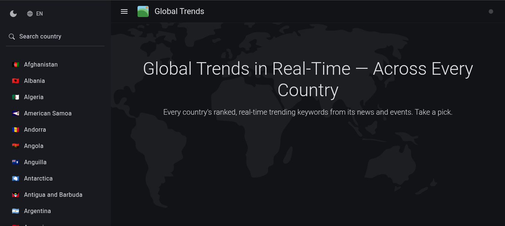

# Global Trends

Building a public dashboard that keeps track of global trending keywords/entities in real-time by countries.

This project was generated using [Angular CLI](https://github.com/angular/angular-cli) version 20.1.5.

---

## Development server

To start a local development server, run:

```bash
ng serve
```

Once the server is running, open your browser and navigate to `http://localhost:4200/`. The application will automatically reload whenever you modify any of the source files.

---

## Building

To build the project run:

```bash
ng build
```

This will compile your project and store the build artifacts in the `dist/` directory. By default, the production build optimizes your application for performance and speed.

## Progress Screenshots

<p align="center">
  
  
</p>